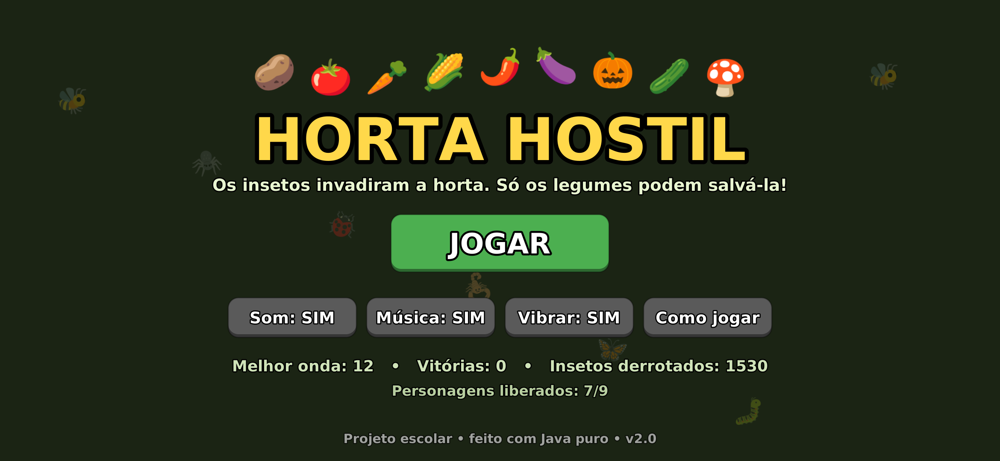
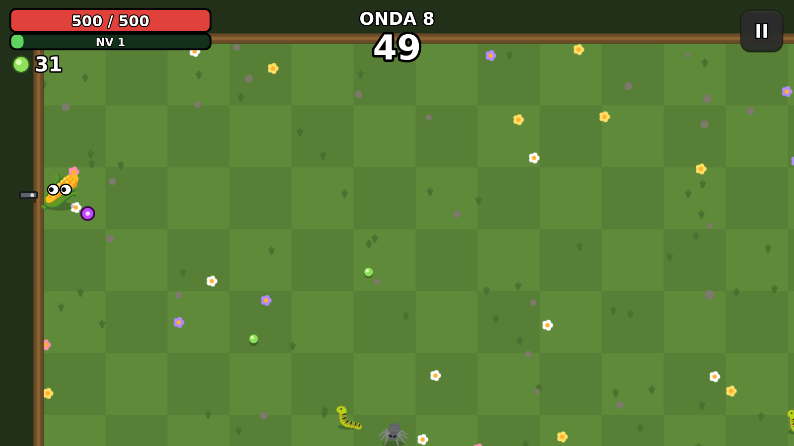
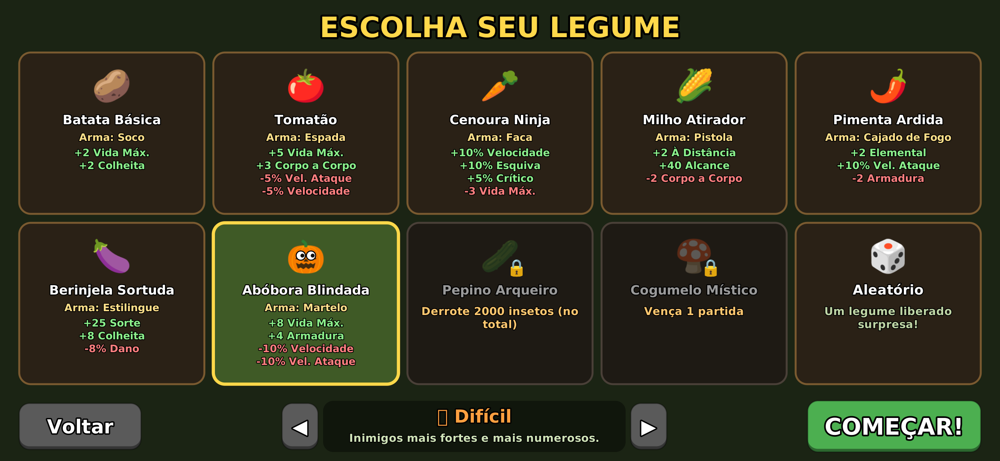
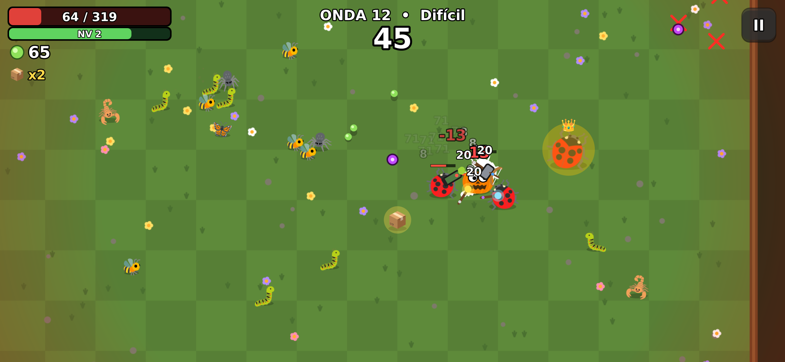
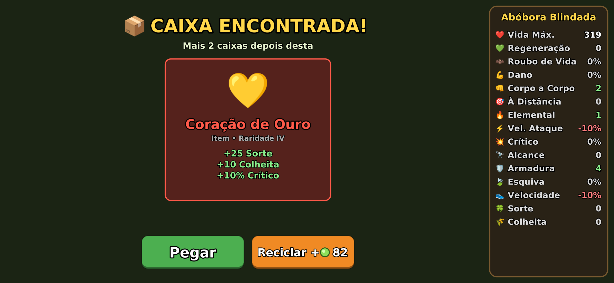
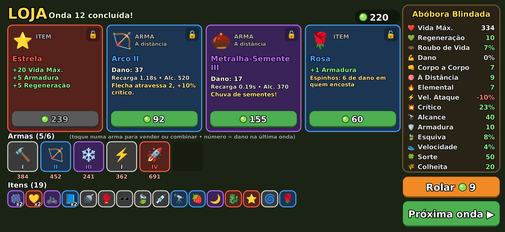
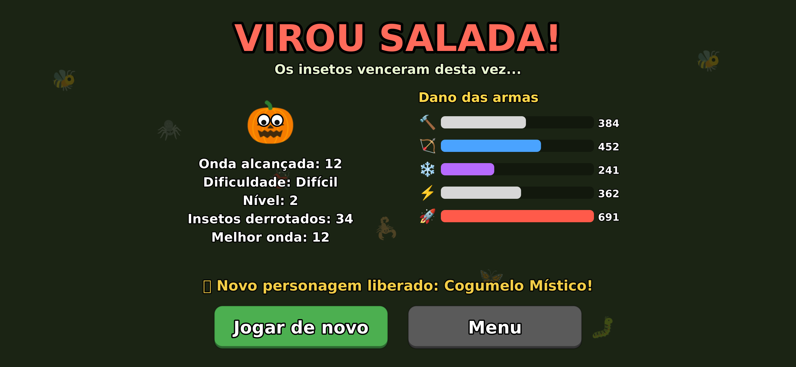

# 🥔 Horta Hostil

Jogo para **Android** no estilo *Brotato*: um roguelite de arena em que você é um
legume armado até os dentes, sobrevivendo a ondas de insetos que invadiram a horta.



## 📲 Como instalar no celular

1. Baixe o arquivo **[`HortaHostil.apk`](HortaHostil.apk)** (clique nele no GitHub e depois em *Download raw file*).
2. Abra o arquivo no celular. Se o Android pedir, permita **"instalar apps de fontes desconhecidas"**.
3. Instale e jogue! (Precisa de Android 7.0 ou mais novo. O jogo roda deitado, na horizontal.)

> O Play Protect pode avisar que o app é "desconhecido". É normal: o app não veio da Play Store.
> É só tocar em *Instalar mesmo assim*.

## 💻📱 Versão para PC e celular (PWA)

A pasta [`pwa/`](pwa) tem o mesmo jogo feito em **HTML5 + JavaScript**. Ele roda no navegador do
**computador e do celular** e pode ser **instalado como aplicativo** (funciona até sem internet depois de instalado).
O jogo percebe sozinho se você está usando teclado/mouse ou toque e muda os controles e as dicas na tela.

| | Computador | Celular / tablet |
|---|---|---|
| Andar | `W A S D` ou setas (ou arrastar o mouse) | arrastar o dedo (joystick) |
| Pausar | `Esc` ou `P` | botão **II** |
| Melhorias / loja | clique ou teclas `1`–`4`, `R` = rolar, `Enter` = próxima onda | tocar nos cartões |
| Ver o que um item faz | passar o mouse | tocar no item |
| Tela cheia | `F` ou botão do menu | automática ao tocar em **Jogar** |

No celular o jogo fica sempre deitado: se o aparelho estiver em pé (ou com a rotação automática
desligada), ele é desenhado de lado, é só virar o celular.

**Como publicar e instalar:**
1. No GitHub, vá em *Settings → Pages* e em *Source* escolha **GitHub Actions**.
2. Junte este branch com o `main`: o workflow `Publicar PWA` coloca o jogo no ar em
   `https://<seu-usuario>.github.io/<repositorio>/`.
3. **No computador:** abra o link no Chrome ou Edge e clique no ícone de **instalar** (⊕) na barra de endereço.
   **No Android:** abra no Chrome, menu ⋮ → **Instalar app** (ou *Adicionar à tela inicial*).
   **No iPhone:** abra no Safari, botão Compartilhar → **Adicionar à Tela de Início**.
   O jogo vira um app com ícone próprio, em tela cheia.

Para testar no seu computador sem publicar: `npx http-server pwa` e abra `http://localhost:8080`.
Para o robô jogar sozinho com a versão JavaScript: `node pwa/sim.js 20`.



## 🎮 Como jogar

- **Arraste o dedo** em qualquer lugar da tela para andar (joystick virtual).
- Suas armas (até 6!) **atacam sozinhas** o inimigo mais próximo.
- Os insetos derrotados soltam **sementes 🌱**, que servem de dinheiro **e** de experiência.
- Sobreviva até o **tempo da onda** acabar. São **20 ondas**, com chefões nas ondas 10 e 20.
- Entre as ondas:
  - **Subiu de nível?** Escolha uma entre 4 melhorias de atributo.
  - **Loja:** compre armas e itens, **tranque** 🔒 o que quiser guardar pra próxima, ou **role** a loja.
  - Toque numa arma sua para **vender** ou **combinar**: duas armas iguais do mesmo nível viram uma de nível maior (I → II → III → IV).

| Escolha do personagem | Em jogo (elite 👑, caixa 📦, vida baixa) |
|---|---|
|  |  |
| **Caixa no fim da onda** | **Loja** |
|  |  |

### Novidades da versão 2.0 (APK)

- **3 personagens novos para desbloquear:** 🎃 Abóbora Blindada (chegue na onda 10),
  🥒 Pepino Arqueiro (derrote 2000 insetos no total) e 🍄 Cogumelo Místico (vença 1 partida).
  Também dá pra escolher **🎲 Aleatório**.
- **4 dificuldades:** Fácil, Normal, Difícil e Pesadelo (o jogo marca ✔ nas que você já venceu).
- **3 armas novas:** 🔨 Martelo (arremessa longe), 🏹 Arco (atravessa 2 inimigos) e
  ❄️ Varinha de Gelo (deixa os inimigos lentos).
- **Inimigo novo:** 🦋 Mariposa, que voa em zigue-zague.
- **Elites 👑:** versões douradas e bem mais fortes dos insetos (a partir da onda 5).
  Sempre deixam uma **caixa 📦**.
- **Caixas:** no fim da onda, cada caixa vira um item grátis (ou pode ser reciclada por sementes).
- **6 itens com efeitos especiais:** 🌀 Redemoinho (pega sementes de mais longe),
  🍌 Banana (frutas curam mais), 🌹 Rosa (espinhos), 🗺️ Mapa do Tesouro (mais caixas),
  🎆 Fogos e 🌋 Vulcão (inimigos explodem ao morrer).
- **Continuar depois:** a partida é salva na loja. Se fechar o app, aparece **Continuar** no menu.
- **Música de fundo** gerada por código (e botão para desligar).
- **Fim de onda animado:** os insetos somem e as sementes voam até você.
- **Aviso de vida baixa:** as bordas da tela piscam em vermelho.
- **Dano de cada arma:** aparece na pausa, na loja e no fim da partida.
- **Toque num item** para ver o que ele faz.
- Recordes: melhor onda, vitórias e total de insetos derrotados.



### Personagens

| | Nome | Arma inicial | Estilo | Como liberar |
|---|---|---|---|---|
| 🥔 | Batata Básica | Soco | Equilibrada | — |
| 🍅 | Tomatão | Espada | Muita vida e dano corpo a corpo, mas lento | — |
| 🥕 | Cenoura Ninja | Faca | Rápida, esquiva e crítico | — |
| 🌽 | Milho Atirador | Pistola | Dano à distância e alcance | — |
| 🌶️ | Pimenta Ardida | Cajado de Fogo | Dano elemental (queimadura) | — |
| 🍆 | Berinjela Sortuda | Estilingue | Sorte e colheita, menos dano | — |
| 🎃 | Abóbora Blindada | Martelo | Armadura e vida, bem lenta | Chegar na onda 10 |
| 🥒 | Pepino Arqueiro | Arco | Crítico e alcance, pouca vida | Derrotar 2000 insetos |
| 🍄 | Cogumelo Místico | Varinha de Gelo | Elemental, regeneração e sorte | Vencer 1 partida |

### Conteúdo

- **14 armas**, **38 itens** (6 com efeito especial), **15 atributos**.
- **6 inimigos** (lagarta, vespa, aranha que cospe, joaninha blindada, escorpião que dá investida,
  mariposa), versões **elite** e **2 chefões** (Lesma Rainha e Formiga Imperatriz).
- Sons e música gerados por código, vibração, recordes e partida salvos no celular.

> A versão para PC/celular no navegador (pasta `pwa/`) ainda é a 1.0: ela não tem as novidades acima.

## 🛠️ Como o projeto funciona (para a apresentação)

Tudo foi feito em **Java puro**, sem motor de jogo e sem bibliotecas: o desenho usa o
`Canvas` do próprio Android, e os gráficos são **emojis** + formas geométricas.

```
app/src/main/
├── AndroidManifest.xml
├── res/                         ícone (vetor) e nome do app
└── java/com/escola/hortahostil/
    ├── MainActivity.java        abre o jogo em tela cheia
    ├── GameView.java            laço do jogo (60 atualizações/s) e toques na tela
    ├── Ui.java                  desenha todas as telas e trata os botões
    ├── Sprites.java             transforma emojis em imagens
    ├── Sfx.java                 sintetiza os efeitos sonoros (sem arquivos de áudio!)
    ├── Prefs.java               salva configurações e recordes
    └── game/                    LÓGICA DO JOGO (não depende do Android)
        ├── Game.java            ondas, inimigos, tiros, colisões, loja, level up
        ├── Player.java          jogador e atributos
        ├── WeaponDef/Weapon     armas
        ├── ItemDef.java         itens
        ├── EnemyDef/Enemy       inimigos e chefões
        └── ...
sim/SimTest.java                 "robô" que joga sozinho para testar e balancear
```

Conceitos usados: laço de jogo com passo fixo, máquina de estados (menu → jogo → level up → loja),
colisão entre círculos, vetores para movimento e mira, probabilidade (raridade dos itens, crítico, esquiva)
e herança/interfaces em Java.

### Compilar o APK você mesmo

Não precisa de Android Studio. Com Java 17+, `curl`, `zip` e `npm` instalados (Linux):

```bash
./build.sh          # gera HortaHostil.apk
./build.sh sim 20   # o robô joga 20 partidas e mostra o resultado
```

O script baixa as ferramentas do Android que faltam (aapt2, d8, android.jar) para a pasta `.tools/`.
A chave em `keystore/horta.p12` (senha `android`) assina o APK; mantenha a mesma chave para que
versões novas instalem por cima da antiga.
