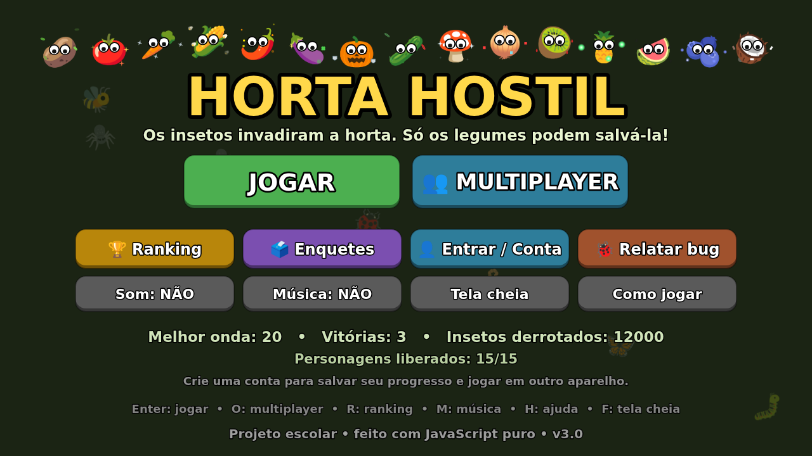
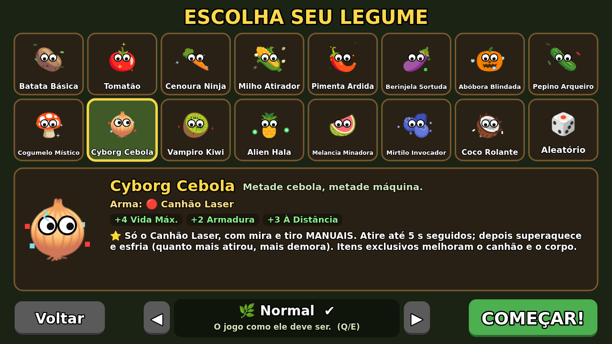
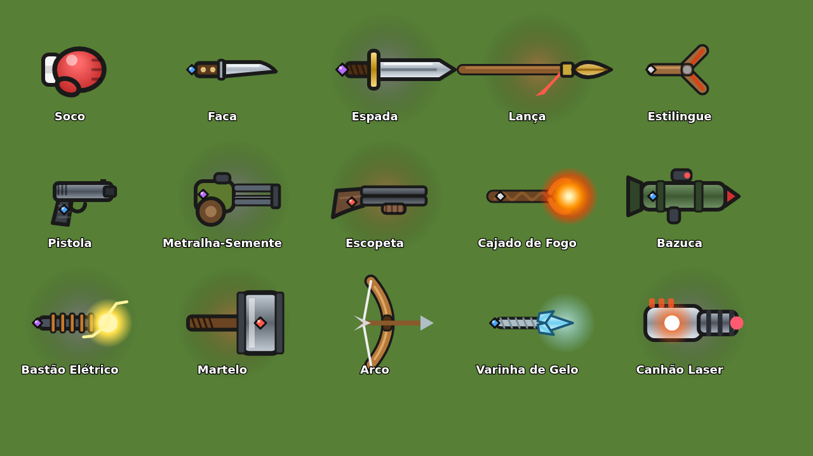
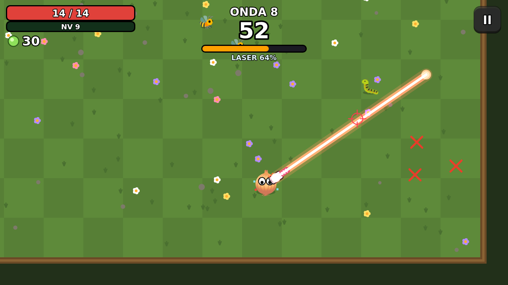
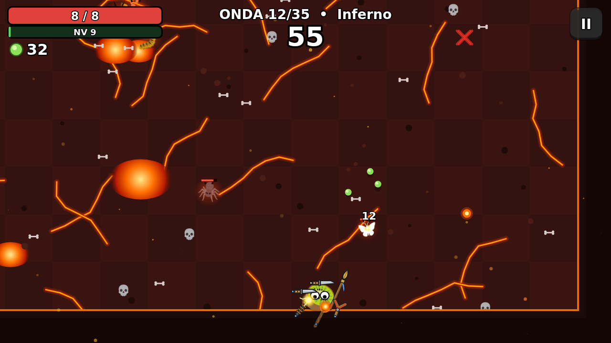
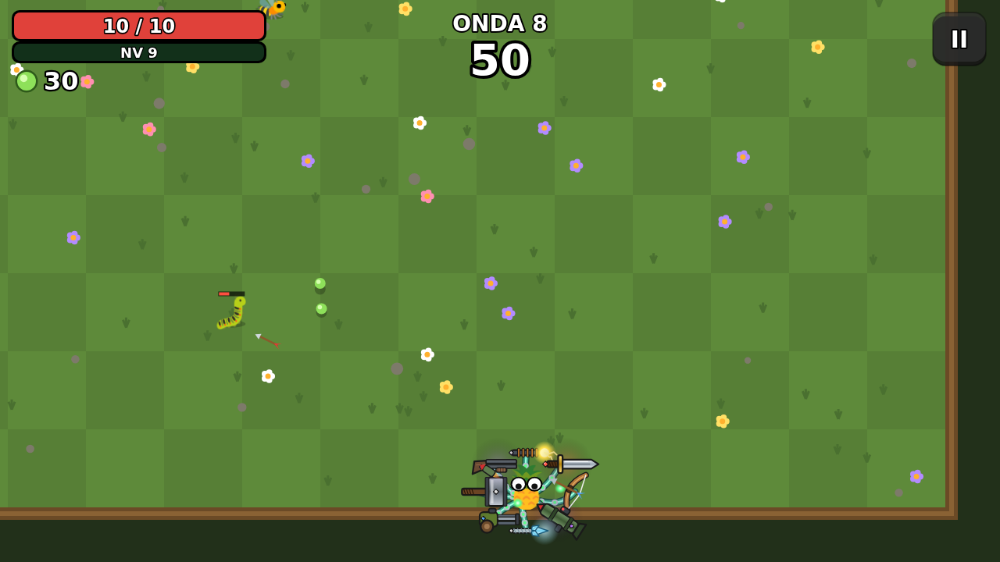
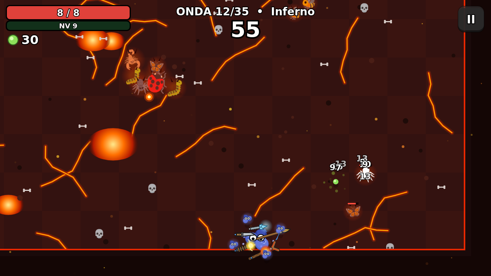
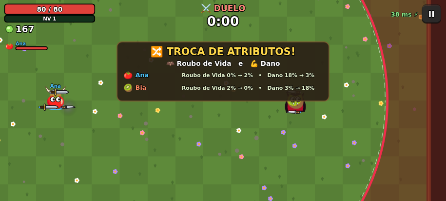
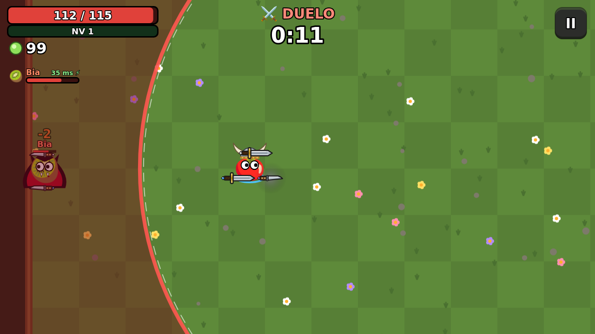
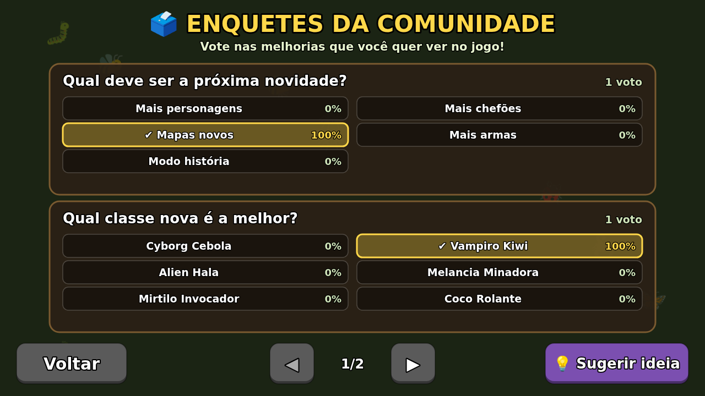

# 🥔 Horta Hostil

Jogo no estilo *Brotato* para **Android, PC e celular**: um roguelite de arena em que você é um
legume armado até os dentes, sobrevivendo a ondas de insetos que invadiram a horta.
Tem **15 personagens**, **6 dificuldades**, **multiplayer cooperativo e PvP**, ranking, contas e enquetes.



## ▶️ Onde jogar

| | |
|---|---|
| 🌐 **No navegador (PC e celular)** | **https://mello13256.github.io/Projeto-apk-random/** |
| 📲 **App Android** | baixe o **[`HortaHostil.apk`](HortaHostil.apk)** (no GitHub: *Download raw file*) |

**Instalar o APK:** abra o arquivo no celular e, se o Android pedir, permita *instalar apps de fontes
desconhecidas* (o Play Protect pode avisar que o app é "desconhecido": toque em *Instalar mesmo assim*).
Precisa de Android 7.0 ou mais novo. Quem já tinha o app antigo pode instalar por cima: os recordes vêm junto.

O site também pode ser **instalado como aplicativo** (Chrome/Edge: ícone ⊕ na barra de endereço;
Android: menu ⋮ → *Instalar app*; iPhone: Compartilhar → *Adicionar à Tela de Início*) e funciona sem internet
depois da primeira visita.

## 🆕 Novidades da versão 3.0

- **6 classes novas**, cada uma com uma mecânica diferente (veja a tabela abaixo).
- **2 dificuldades novas:** 😈 **Inferno** (a máxima: 35 ondas numa horta em chamas, insetos infernais e o
  chefão novo **Besouro Infernal**) e ♾️ **Infinito** (o Pesadelo sem fim: chefões a cada 10 ondas).
- **⚔️ Modo PvP** no multiplayer: 15 rodadas para cada um se preparar e depois um duelo numa arena que fecha.
- **👤 Contas:** salve o progresso na nuvem e continue em outro aparelho (site ou app).
- **🗳️ Enquetes** da comunidade e **🐞 Relatar bug / sugerir ideia** direto do jogo.
- **Visual novo:** cada legume tem pequenas partículas animadas em volta que mostram o que ele é (brasas na
  Pimenta, pipocas no Milho, estrelinhas ninja na Cenoura, gotas no Vampiro, pixels no Cyborg...) e todas as
  armas e projéteis foram redesenhados com detalhes.
- **Corrigido:** quando a onda acabava e você andava, as armas ficavam pra trás.
- **O app Android agora tem o jogo completo** (o mesmo do site, embutido no APK e funcionando offline).

| Escolha do personagem | Armas redesenhadas |
|---|---|
|  |  |
| **Cyborg Cebola e o canhão laser** | **Inferno** |
|  |  |
| **Alien Hala com 8 armas** | **Mirtilo Invocador no Inferno** |
|  |  |

## 🧑‍🌾 Personagens

| | Nome | Arma inicial | Estilo | Como liberar |
|---|---|---|---|---|
| 🥔 | Batata Básica | Soco | Equilibrada | — |
| 🍅 | Tomatão | Espada | Muita vida e dano corpo a corpo, mas lento | — |
| 🥕 | Cenoura Ninja | Faca | Rápida, esquiva e crítico | — |
| 🌽 | Milho Atirador | Pistola | Dano à distância e alcance | — |
| 🌶️ | Pimenta Ardida | Cajado de Fogo | Dano elemental (queimadura) | — |
| 🍆 | Berinjela Sortuda | Estilingue | Sorte e colheita, menos dano | — |
| 🎃 | Abóbora Blindada | Martelo | Armadura e vida, bem lenta | Chegar na onda 10 |
| 🥒 | Pepino Arqueiro | Arco | Crítico e alcance, pouca vida | Derrotar 2000 insetos |
| 🍄 | Cogumelo Místico | Varinha de Gelo | Elemental, regeneração e sorte | Vencer 1 partida |
| 🧅 | **Cyborg Cebola** | **Canhão Laser** | Só o canhão, com **mira e tiro manuais**. Atira até 5 s seguidos; depois **superaquece** e esfria (o tempo de esfriar é proporcional ao tempo de tiro). Tem **12 itens exclusivos** que melhoram o canhão (dano, alcance, largura, feixes extras, explosão ao superaquecer) e o corpo | Derrotar 10000 insetos **e** vencer no Pesadelo |
| 🥝 | **Vampiro Kiwi** | Faca | Ataques corpo a corpo com **+30% de roubo de vida** e **+10% de esquiva** | Chegar a 50% de roubo de vida numa partida e vencê-la |
| 🍍 | **Alien Hala** | Bastão Elétrico | Segura **8 armas** com tentáculos tecnológicos, **+50 de alcance** e só encontra **itens Alien** (versões melhores) | Vencer com todas as armas no nível IV e mais de 100 de alcance |
| 🍉 | **Melancia Minadora** | Estilingue | Planta **minas** enquanto anda; explodem quando um inseto chega perto | Vencer no Difícil (ou mais) |
| 🫐 | **Mirtilo Invocador** | Varinha de Gelo | **Mirtilinhos** voam em volta e atiram sozinhos (mais um a cada 4 níveis, até 6) | Jogar 10 partidas |
| 🥥 | **Coco Rolante** | Soco | **Atropela** os insetos: andando, quem encosta leva dano (mais velocidade e armadura = mais dano) | Coletar 20000 sementes (no total) |

**Controles do Cyborg:** no PC, `W A S D` anda, o **mouse mira** e o **clique (ou Espaço) atira**.
No celular, o lado **esquerdo** da tela é o analógico de andar e o lado **direito** é o de mirar e atirar.

## 🎮 Como jogar

- Arraste o dedo (ou use `W A S D`/setas) para andar. As armas **atacam sozinhas** (menos o canhão do Cyborg).
- Os insetos soltam **sementes 🌱**: dinheiro **e** experiência. **Elites 👑** sempre deixam uma **caixa 📦**.
- Sobreviva até o tempo da onda acabar. Entre as ondas: escolha **melhorias**, abra as **caixas** e compre na **loja**
  (tranque 🔒 o que quiser guardar, role a loja, venda ou **combine** duas armas iguais para subir de nível).
- A partida fica salva na loja: dá pra **continuar depois**.

| Dificuldade | Ondas | |
|---|---|---|
| 🌱 Fácil | 20 | inimigos mais fracos |
| 🌿 Normal | 20 | o jogo como ele deve ser |
| 🔥 Difícil | 20 | inimigos mais fortes e numerosos |
| 💀 Pesadelo | 20 | mais elites e muito mais dano |
| 😈 Inferno | **35** | a máxima: mapa infernal, chefões nas ondas 10, 20, 30 e o **Besouro Infernal** na 35 |
| ♾️ Infinito | **sem fim** | o Pesadelo sem limite de ondas (chefões a cada 10) — até onde você chega? |

| | Computador | Celular / tablet |
|---|---|---|
| Andar | `W A S D` ou setas | arrastar o dedo |
| Pausar / menu | `Esc` ou `P` | botão **II** |
| Melhorias / loja | clique ou `1`–`4`, `R` = rolar, `Enter` = próxima onda | tocar |
| Tela cheia | `F` | automática |

## 👥 Multiplayer (2 a 4 jogadores)

Toque em **👥 MULTIPLAYER** → **Criar sala** e passe o código de 4 letras (ou o link do **🔗 Convidar**).
Os amigos tocam em **Entrar numa sala**. Cada um escolhe o legume e fica **Pronto**; o dono da sala escolhe
o **modo** e a **dificuldade** e começa.

**🤝 Cooperativo:** todos na mesma arena. As sementes são do time, quem cai vira fantasminha 👻 e volta na onda
seguinte, e a loja de cada um é no próprio aparelho (a próxima onda começa quando todos ficam prontos).

**⚔️ PvP (todos contra todos):**
1. Cada um joga **15 rodadas** sozinho no próprio aparelho para montar o seu legume (cair só acaba a rodada).
2. Quando todos terminam, **2 atributos sorteados são trocados** entre os jogadores (com 2 jogadores é uma troca;
   com mais, cada um recebe os do próximo).
3. Todos entram numa **arena que vai fechando**: fora do círculo você perde vida. O último de pé vence!

| Troca de atributos | Duelo |
|---|---|
|  |  |

**Como funciona por dentro:** o aparelho do dono da sala roda a partida; os outros mandam a posição (e a mira,
no caso do Cyborg) e recebem a arena 20 vezes por segundo, com o próprio movimento calculado na hora.
A conexão é **direta (WebRTC)**; o **Firebase** só serve para achar a sala, e vira o caminho de reserva se a rede
bloquear a conexão direta (a sala mostra "direto ⚡" ou "via servidor 🌐", e o jogo mostra o ping).

## 🏆 Ranking, 👤 contas, 🗳️ enquetes e 🐞 bugs

Tudo fica no **Firebase Realtime Database** (plano gratuito), acessado pela API REST sem bibliotecas.

- **Ranking:** os 20 melhores de cada dificuldade (site e app juntos). No fim da partida, *Enviar pro ranking*.
- **Contas:** nome + senha, sem e-mail. O progresso (recordes, personagens liberados, partida salva) é guardado
  num endereço calculado a partir do nome e da senha (SHA-256), então só quem sabe a senha consegue ler ou mudar.
  Ao entrar num aparelho, o progresso dele e o da conta são juntados (fica o melhor de cada). Não dá pra recuperar
  a senha, então anote!
- **Enquetes:** já vêm 4 no jogo. Para **criar outras**, no console do Firebase vá em *Realtime Database → Dados*,
  crie `polls/<id>` com `q` (a pergunta) e `o` (lista de opções). Para fechar uma, ponha `open: false`.
- **Relatar bug / sugerir ideia:** no menu, na pausa ou nas enquetes. Os relatos aparecem no console do Firebase,
  em `reports` (junto vão a versão do jogo e onde o jogador estava; ninguém além de você consegue ler).



**Regras de segurança:** o arquivo [`firebase-rules.json`](firebase-rules.json) tem as regras de tudo isso
(o que cada um pode ler/escrever e o tamanho de cada campo). Sempre que ele mudar, cole o arquivo inteiro em
*Realtime Database → Regras* e clique em **Publicar**.

## 🛠️ Como o projeto funciona (para a apresentação)

O jogo é feito em **JavaScript puro**, sem motor de jogo e sem bibliotecas: o desenho usa o `Canvas` do navegador,
e os gráficos são **emojis** + desenhos feitos com código (partículas dos legumes, armas, mapa do Inferno).
O **app Android** é um programinha em Java que abre esse mesmo jogo dentro dele (WebView), sem precisar de internet.

```
pwa/                      o jogo (site e app usam os mesmos arquivos)
├── index.html            página do jogo
├── sw.js                 guarda os arquivos para funcionar offline
├── sim.js                "robô" que joga sozinho para testar e equilibrar
└── js/
    ├── data.js           personagens, armas, itens, inimigos e dificuldades
    ├── game.js           regras: ondas, combate, classes, loja, duelo PvP
    ├── ui.js             telas, botões e controles
    ├── art.js            desenhos: partículas dos legumes, armas, projéteis, mapa do Inferno
    ├── sfx.js            sons e música gerados por código (sem arquivos de áudio)
    ├── net.js            Firebase (REST + tempo real) e conexão direta (WebRTC)
    ├── mp.js             multiplayer: salas, sincronização, cooperativo e PvP
    ├── community.js      contas, enquetes e relatórios de bug
    ├── ranking.js        ranking online
    └── main.js           liga tudo e roda o laço do jogo (60 vezes por segundo)
app/src/main/             app Android (MainActivity.java + ícone)
tools/fake-firebase.js    Firebase "de mentira" para testar o multiplayer sem internet
firebase-rules.json       regras de segurança do banco
```

Conceitos usados: laço de jogo com passo fixo, máquina de estados, colisão entre círculos e entre círculo e
segmento (o laser), vetores para movimento e mira, probabilidade, previsão de movimento na rede, criptografia
(hash SHA-256 nas contas) e comunicação cliente/servidor e ponto a ponto.

### Testar e compilar

```bash
npx http-server pwa              # abre o jogo em http://localhost:8080
node pwa/sim.js 12               # o robô joga 12 partidas em cada dificuldade
node pwa/sim.js coop 4           # partidas cooperativas com 2, 3 e 4 robôs
node pwa/sim.js duel 6           # 6 duelos PvP (15 rodadas de preparação + arena)
node tools/fake-firebase.js 9000 # Firebase local: abra o jogo com ?db=http://localhost:9000
./build.sh                       # gera o HortaHostil.apk (Java 17+, curl, zip e npm)
```

O `build.sh` baixa as ferramentas do Android que faltam (aapt2, d8, android.jar) para `.tools/`, copia a pasta
`pwa/` para dentro do app e assina com a chave `keystore/horta.p12` (senha `android`; mantenha a mesma chave para
que as versões novas instalem por cima). A versão antiga do app, com o jogo inteiro escrito em Java, está no
histórico do repositório (commit `ef5c9f3`).

O site é publicado pelo **GitHub Pages** com o workflow [`.github/workflows/pages.yml`](.github/workflows/pages.yml),
a cada push que muda a pasta `pwa/` ou o APK.
