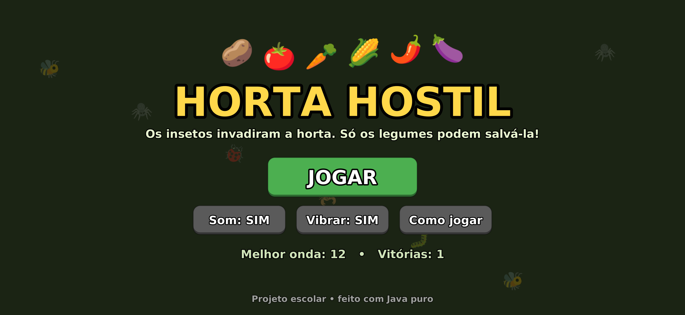
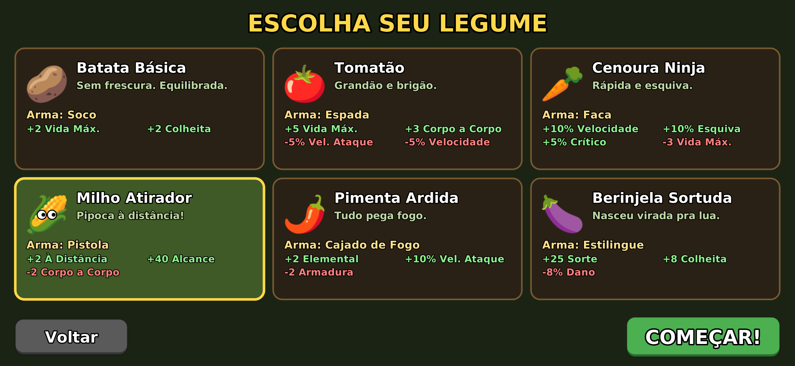
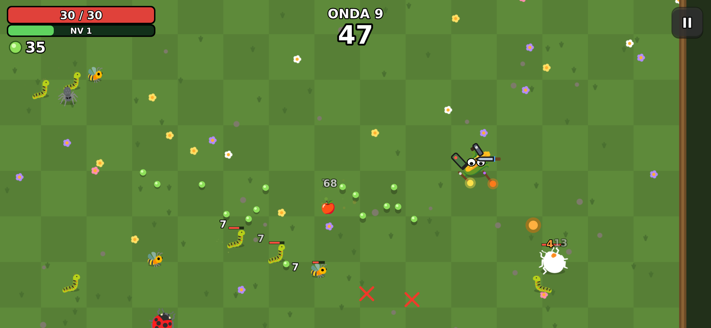
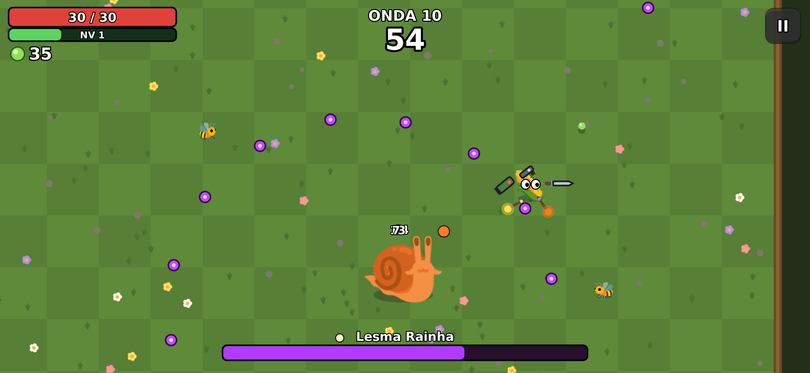
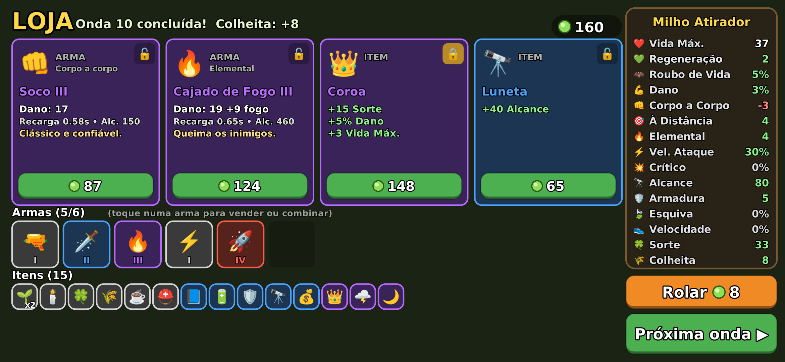

# 🥔 Horta Hostil

Jogo para **Android** no estilo *Brotato*: um roguelite de arena em que você é um
legume armado até os dentes, sobrevivendo a ondas de insetos que invadiram a horta.



## 📲 Como instalar no celular

1. Baixe o arquivo **[`HortaHostil.apk`](HortaHostil.apk)** (clique nele no GitHub e depois em *Download raw file*).
2. Abra o arquivo no celular. Se o Android pedir, permita **"instalar apps de fontes desconhecidas"**.
3. Instale e jogue! (Precisa de Android 7.0 ou mais novo. O jogo roda deitado, na horizontal.)

> O Play Protect pode avisar que o app é "desconhecido". É normal: o app não veio da Play Store.
> É só tocar em *Instalar mesmo assim*.

## 💻 Versão para computador (PWA)

A pasta [`pwa/`](pwa) tem o mesmo jogo feito em **HTML5 + JavaScript**, para jogar no navegador
do computador e **instalar como aplicativo** (funciona até sem internet depois de instalado).

**Controles no computador:** `W A S D` ou setas = andar • `Esc`/`P` = pausar • `F` = tela cheia •
`1`–`4` = escolher melhoria / comprar na loja • `R` = rolar • `Enter` = próxima onda.
O mouse também funciona em todos os botões (e no celular, dá pra jogar arrastando o dedo).

**Como publicar e instalar:**
1. No GitHub, vá em *Settings → Pages* e em *Source* escolha **GitHub Actions**.
2. Junte este branch com o `main`: o workflow `Publicar PWA` coloca o jogo no ar em
   `https://<seu-usuario>.github.io/<repositorio>/`.
3. Abra o link no Chrome ou Edge e clique no ícone de **instalar** (⊕) na barra de endereço.
   O jogo vira um app com ícone próprio, em tela cheia.

Para testar no seu computador sem publicar: `npx http-server pwa` e abra `http://localhost:8080`.
Para o robô jogar sozinho com a versão JavaScript: `node pwa/sim.js 20`.


## 🎮 Como jogar

- **Arraste o dedo** em qualquer lugar da tela para andar (joystick virtual).
- Suas armas (até 6!) **atacam sozinhas** o inimigo mais próximo.
- Os insetos derrotados soltam **sementes 🌱**, que servem de dinheiro **e** de experiência.
- Sobreviva até o **tempo da onda** acabar. São **20 ondas**, com chefões nas ondas 10 e 20.
- Entre as ondas:
  - **Subiu de nível?** Escolha uma entre 4 melhorias de atributo.
  - **Loja:** compre armas e itens, **tranque** 🔒 o que quiser guardar pra próxima, ou **role** a loja.
  - Toque numa arma sua para **vender** ou **combinar**: duas armas iguais do mesmo nível viram uma de nível maior (I → II → III → IV).

| Escolha do personagem | Em jogo |
|---|---|
|  |  |
| **Chefão: Lesma Rainha** | **Loja** |
|  |  |

### Personagens

| | Nome | Arma inicial | Estilo |
|---|---|---|---|
| 🥔 | Batata Básica | Soco | Equilibrada |
| 🍅 | Tomatão | Espada | Muita vida e dano corpo a corpo, mas lento |
| 🥕 | Cenoura Ninja | Faca | Rápida, esquiva e crítico |
| 🌽 | Milho Atirador | Pistola | Dano à distância e alcance |
| 🌶️ | Pimenta Ardida | Cajado de Fogo | Dano elemental (queimadura) |
| 🍆 | Berinjela Sortuda | Estilingue | Sorte e colheita, menos dano |

### Conteúdo

- **11 armas:** Soco, Faca, Espada, Lança, Estilingue (ricochete), Pistola (atravessa),
  Metralha-Semente, Escopeta, Cajado de Fogo (queima), Bazuca (explosão) e Bastão Elétrico (raio que pula entre alvos).
- **32 itens** com vantagens e desvantagens (ex.: *Café* ☕ = +8% vel. ataque, −1 vida).
- **15 atributos:** vida, regeneração, roubo de vida, dano, corpo a corpo, à distância, elemental,
  velocidade de ataque, crítico, alcance, armadura, esquiva, velocidade, sorte e colheita.
- **5 inimigos** (lagarta, vespa, aranha que cospe, joaninha blindada, escorpião que dá investida)
  e **2 chefões** (Lesma Rainha e Formiga Imperatriz).
- Sons gerados por código, vibração, recordes salvos no celular.

## 🛠️ Como o projeto funciona (para a apresentação)

Tudo foi feito em **Java puro**, sem motor de jogo e sem bibliotecas: o desenho usa o
`Canvas` do próprio Android, e os gráficos são **emojis** + formas geométricas.

```
app/src/main/
├── AndroidManifest.xml
├── res/                         ícone (vetor) e nome do app
└── java/com/escola/hortahostil/
    ├── MainActivity.java        abre o jogo em tela cheia
    ├── GameView.java            laço do jogo (60 atualizações/s) e toques na tela
    ├── Ui.java                  desenha todas as telas e trata os botões
    ├── Sprites.java             transforma emojis em imagens
    ├── Sfx.java                 sintetiza os efeitos sonoros (sem arquivos de áudio!)
    ├── Prefs.java               salva configurações e recordes
    └── game/                    LÓGICA DO JOGO (não depende do Android)
        ├── Game.java            ondas, inimigos, tiros, colisões, loja, level up
        ├── Player.java          jogador e atributos
        ├── WeaponDef/Weapon     armas
        ├── ItemDef.java         itens
        ├── EnemyDef/Enemy       inimigos e chefões
        └── ...
sim/SimTest.java                 "robô" que joga sozinho para testar e balancear
```

Conceitos usados: laço de jogo com passo fixo, máquina de estados (menu → jogo → level up → loja),
colisão entre círculos, vetores para movimento e mira, probabilidade (raridade dos itens, crítico, esquiva)
e herança/interfaces em Java.

### Compilar o APK você mesmo

Não precisa de Android Studio. Com Java 17+, `curl`, `zip` e `npm` instalados (Linux):

```bash
./build.sh          # gera HortaHostil.apk
./build.sh sim 20   # o robô joga 20 partidas e mostra o resultado
```

O script baixa as ferramentas do Android que faltam (aapt2, d8, android.jar) para a pasta `.tools/`.
A chave em `keystore/horta.p12` (senha `android`) assina o APK; mantenha a mesma chave para que
versões novas instalem por cima da antiga.
